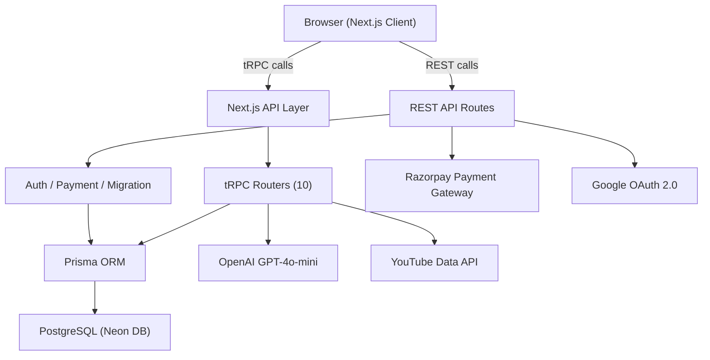
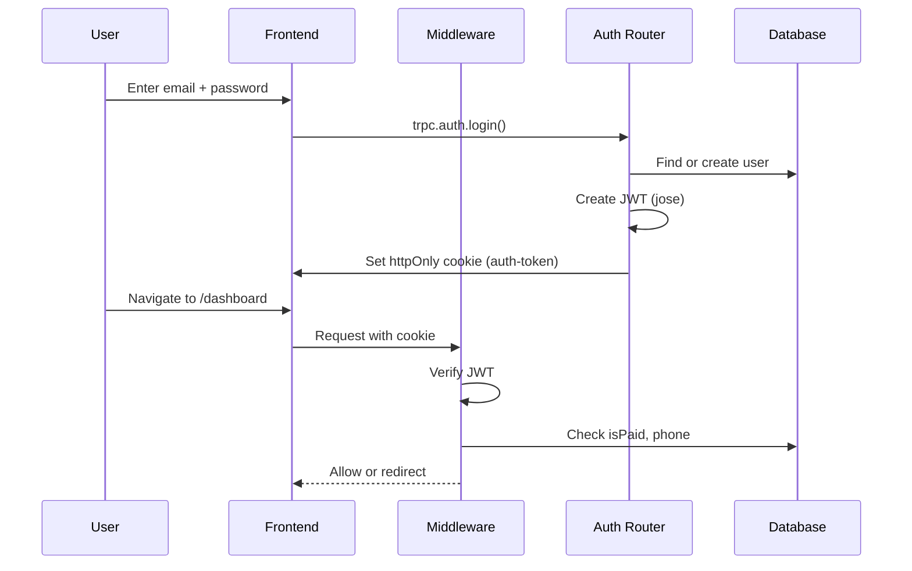

# 📚 Saviours AI — Complete Technical Documentation

> **Version**: March 2026  
> **Stack**: Next.js 14 · TypeScript · tRPC · Prisma · PostgreSQL (Neon) · OpenAI · Razorpay

---

## What is Saviours AI?

**Saviours AI** is a full-stack AI-powered exam preparation platform built specifically for **ICSE Class 9–10 students**. It combines intelligent study planning, AI-assisted doubt solving, practice testing, and interactive content mastery tools into a single premium web application.

The platform covers **10 ICSE subjects**: Physics, Chemistry, Biology, Mathematics, English Language, English Literature, History & Civics, Geography, Computer Applications, and more.

---

## Architecture Overview

### Tech Stack

| Layer          | Technology                            |
| -------------- | ------------------------------------- |
| **Framework**  | Next.js 14 (App Router)               |
| **Language**   | TypeScript (strict)                   |
| **API Layer**  | tRPC v11 + REST API routes            |
| **Database**   | PostgreSQL on Neon (serverless)       |
| **ORM**        | Prisma                                |
| **AI Engine**  | OpenAI GPT-4o-mini                    |
| **Auth**       | JWT (jose) + Google OAuth 2.0         |
| **Payments**   | Razorpay                              |
| **Styling**    | Inline CSS + Vanilla CSS (dark theme) |
| **Deployment** | Vercel                                |

---

## Authentication System

### Flow

### Key Details

- **JWT-based** authentication using `jose` library
- **Auto-signup**: Login router creates accounts automatically if user doesn't exist
- **Google OAuth**: Separate flow via `/api/auth/google` → `/api/auth/google/callback`
- **Session cookie**: `auth-token`, httpOnly, secure, 7-day expiry
- **Password hashing**: bcrypt
- **Rate limiting**: In-memory rate limiter (5 attempts per 60s per email)

### Middleware ([middleware.ts](file:///Users/harshitsingh/Documents/icse%20saviours/src/middleware.ts))

The middleware enforces a multi-step gate:

1. **Auth Gate**: Unauthenticated users → `/login`
2. **Onboarding Gate**: Users without phone number → `/onboarding`
3. **Payment Gate**: Unpaid users → `/pricing` (with DB fallback to handle stale tokens)
4. **Legacy User Support**: Users created before Jan 29, 2026 are treated as paid
5. **Token Refresh**: If DB shows `isPaid=true` but token says `false`, token is auto-refreshed

---

## Payment Integration (Razorpay)

| Route                                                                                                               | Purpose                               |
| ------------------------------------------------------------------------------------------------------------------- | ------------------------------------- |
| [/api/create-order](file:///Users/harshitsingh/Documents/icse%20saviours/src/app/api/create-order/route.ts)         | Creates a Razorpay order for the user |
| [/api/razorpay-webhook](file:///Users/harshitsingh/Documents/icse%20saviours/src/app/api/razorpay-webhook/route.ts) | Handles payment confirmation webhooks |

- [RazorpayButton.tsx](file:///Users/harshitsingh/Documents/icse%20saviours/src/components/RazorpayButton.tsx) — Client component that renders the checkout modal
- On successful payment, `isPaid` is set to `true` in the DB and a fresh JWT is issued

---

## Backend: tRPC Routers

All routers are merged in [\_app.ts](file:///Users/harshitsingh/Documents/icse%20saviours/src/server/routers/_app.ts) and served via `/api/trpc/[trpc]`.

### 1. `auth` Router ([auth.ts](file:///Users/harshitsingh/Documents/icse%20saviours/src/server/routers/auth.ts))

| Procedure     | Type     | Description                                             |
| ------------- | -------- | ------------------------------------------------------- |
| `signup`      | mutation | Create new account (email, password, name, phone, role) |
| `login`       | mutation | Login or auto-signup; generates JWT                     |
| `logout`      | mutation | Clears session cookie                                   |
| `getMe`       | query    | Returns current authenticated user                      |
| `updatePhone` | mutation | Sets phone number during onboarding                     |

---

### 2. `dashboard` Router ([dashboard.ts](file:///Users/harshitsingh/Documents/icse%20saviours/src/server/routers/dashboard.ts))

| Procedure       | Type  | Description                                                               |
| --------------- | ----- | ------------------------------------------------------------------------- |
| `getProfile`    | query | User profile with student/teacher details                                 |
| `getStudyStats` | query | Today's hours, weekly progress, streak, exam readiness, subject breakdown |

---

### 3. `ai` Router ([ai.ts](file:///Users/harshitsingh/Documents/icse%20saviours/src/server/routers/ai.ts))

| Procedure            | Type     | Description                                                                   |
| -------------------- | -------- | ----------------------------------------------------------------------------- |
| `askDoubt`           | mutation | AI doubt solver with image/PDF upload support + YouTube video recommendations |
| `generatePlan`       | mutation | AI-powered study plan generation                                              |
| `summarize`          | mutation | Content summarization for ICSE students                                       |
| `generateQuestions`  | mutation | Generate MCQ practice questions                                               |
| `getUsageStats`      | query    | Token usage, feature counts, recent logs                                      |
| `generateFlashcards` | mutation | Generate quiz-style flashcards                                                |

**AI Model**: `gpt-4o-mini` (supports vision for image uploads)  
**Rate Limit**: Per-user, checked via `checkAiRateLimit()`  
**Usage Tracking**: Every AI call is logged to `AiUsageLog` table

---

### 4. `planner` Router ([planner.ts](file:///Users/harshitsingh/Documents/icse%20saviours/src/server/routers/planner.ts))

| Procedure            | Type     | Description                                                                                     |
| -------------------- | -------- | ----------------------------------------------------------------------------------------------- |
| `generateSmartPlan`  | mutation | AI-powered study plan: difficulty prediction → distribution → topic decomposition → daily plans |
| `getMyPlans`         | query    | All plans (optional date range filter)                                                          |
| `getTodayPlans`      | query    | Today's plans only (for dashboard)                                                              |
| `togglePlanComplete` | mutation | Mark plan as completed/incomplete                                                               |
| `updatePlanNotes`    | mutation | Add notes to a plan                                                                             |
| `deletePlan`         | mutation | Delete a single plan                                                                            |
| `clearAllPlans`      | mutation | Wipe all plans                                                                                  |

**Smart Features**: Uses `predictMultipleChapterDifficulties()`, `calculateStudyDistribution()`, `checkTimelineFeasibility()`, and `decomposeChapterIntoTopics()` from [smart-planner.ts](file:///Users/harshitsingh/Documents/icse%20saviours/src/lib/smart-planner.ts).

---

### 5. `content` Router ([content.ts](file:///Users/harshitsingh/Documents/icse%20saviours/src/server/routers/content.ts))

| Procedure              | Type     | Description                                          |
| ---------------------- | -------- | ---------------------------------------------------- |
| `getSubjects`          | query    | All ICSE subjects                                    |
| `getChaptersBySubject` | query    | Chapters for a subject                               |
| `getTopicsByChapter`   | query    | Topics for a chapter                                 |
| `getTopicContent`      | query    | Content for a specific topic                         |
| `getNotes`             | query    | User's notes (with flashcards)                       |
| `createNote`           | mutation | Create note → AI refines → auto-generates flashcards |
| `updateNote`           | mutation | Update existing note                                 |
| `deleteNote`           | mutation | Delete a note                                        |

**Auto-refinement**: Notes are refined using AI (`refineNotes()`) before saving.  
**Auto-flashcards**: Flashcards are auto-generated from note content via `generateFlashcards()`.

---

### 6. `test` Router ([test.ts](file:///Users/harshitsingh/Documents/icse%20saviours/src/server/routers/test.ts))

| Procedure       | Type     | Description                                                                       |
| --------------- | -------- | --------------------------------------------------------------------------------- |
| `createTest`    | mutation | Generate AI MCQs → create test attempt                                            |
| `getAttempt`    | query    | Get test attempt details                                                          |
| `saveAnswer`    | mutation | Save answer for a question                                                        |
| `markForReview` | mutation | Flag question for review                                                          |
| `submitTest`    | mutation | Submit test → calculate results (accuracy, strong/weak chapters, time management) |
| `getHistory`    | query    | Last 20 test attempts                                                             |

---

### 7. `profile` Router ([profile.ts](file:///Users/harshitsingh/Documents/icse%20saviours/src/server/routers/profile.ts))

| Procedure    | Type     | Description                               |
| ------------ | -------- | ----------------------------------------- |
| `getProfile` | query    | Full profile with student/teacher details |
| `updateName` | mutation | Update display name                       |

---

### 8. `strategy` Router ([strategy.ts](file:///Users/harshitsingh/Documents/icse%20saviours/src/server/routers/strategy.ts))

| Procedure  | Type     | Description                                              |
| ---------- | -------- | -------------------------------------------------------- |
| `generate` | mutation | AI exam strategy: 3 modes (SURVIVAL / BALANCED / TOPPER) |

Inputs: subjects, strengths, weaknesses, goals (exam, score, date), schedule (school/tuition/study hours).

---

### 9. `focus` Router ([focus.ts](file:///Users/harshitsingh/Documents/icse%20saviours/src/server/routers/focus.ts))

| Procedure           | Type     | Description                                                    |
| ------------------- | -------- | -------------------------------------------------------------- |
| `logSession`        | mutation | Log a focus session (subject, mode, duration, quality, blocks) |
| `getRecentSessions` | query    | Recent focus sessions (up to 20)                               |

---

### 10. `precision` Router ([precision.ts](file:///Users/harshitsingh/Documents/icse%20saviours/src/server/routers/precision.ts))

| Procedure    | Type     | Description                                            |
| ------------ | -------- | ------------------------------------------------------ |
| `saveResult` | mutation | Save precision practice result with detailed analytics |
| `getHistory` | query    | Precision practice history (last 20)                   |

---

## REST API Routes

| Route                       | Method   | Purpose                                             |
| --------------------------- | -------- | --------------------------------------------------- |
| `/api/trpc/[trpc]`          | POST/GET | tRPC handler for all routers                        |
| `/api/auth/google`          | GET      | Initiates Google OAuth flow                         |
| `/api/auth/google/callback` | GET      | Handles Google OAuth callback, creates/logs in user |
| `/api/create-order`         | POST     | Creates a Razorpay payment order                    |
| `/api/razorpay-webhook`     | POST     | Processes Razorpay payment webhooks                 |
| `/api/migrate-db`           | POST     | Runs Prisma migrations (admin)                      |
| `/api/test-body`            | POST     | Debugging endpoint for request body parsing         |

---

## Frontend: Dashboard Features

All features live under `/dashboard/` and are client-side React components with inline CSS styling. The dark theme uses #030305 background with electric blue (#3B82F6), cyan (#06B6D4), and purple (#8B5CF6) accents.

### Feature Map

| #   | Feature                | Route                           | Description                                                           |
| --- | ---------------------- | ------------------------------- | --------------------------------------------------------------------- |
| 1   | **Dashboard Home**     | `/dashboard`                    | Study stats, today's plans, streak, exam readiness, subject breakdown |
| 2   | **Subjects**           | `/dashboard/subjects`           | Browse ICSE subjects → chapters → topics                              |
| 3   | **Planner**            | `/dashboard/planner`            | AI-powered smart study planner with daily tasks                       |
| 4   | **AI Assistant**       | `/dashboard/ai-assistant`       | Chat with AI tutor, upload images/PDFs, get YouTube recommendations   |
| 5   | **Customise Test**     | `/dashboard/tests`              | Create custom AI-generated MCQ tests                                  |
| 6   | **Competency Test**    | `/dashboard/precision-practice` | Timed PYQ-based competency testing with detailed analytics            |
| 7   | **Numerical Mastery**  | `/dashboard/numerical-mastery`  | Physics numericals: chapters → topics → formulas → PYQs               |
| 8   | **Guess Papers**       | `/dashboard/guess-papers`       | ICSE specimen/guess papers for all subjects                           |
| 9   | **Customise Strategy** | `/dashboard/strategy`           | AI study strategy (Survival/Balanced/Topper modes)                    |
| 10  | **ChronoScroll**       | `/dashboard/chronoscroll`       | Interactive History & Civics timeline with key dates                  |
| 11  | **Date Battle Arena**  | `/dashboard/date-battle`        | Gamified history date learning through battles                        |
| 12  | **Notes**              | `/dashboard/notes`              | AI-refined notes with auto-generated flashcards                       |
| 13  | **Focus Mode**         | `/dashboard/focus`              | Pomodoro-style focus timer (Classic/Custom/Flexible modes)            |
| 14  | **Profile**            | `/dashboard/profile`            | User profile management                                               |
| 15  | **Policies**           | `/dashboard/policies`           | Terms, privacy, refund policies                                       |
| 16  | **Activity**           | `/dashboard/activity`           | Study activity log                                                    |

### Sidebar Navigation ([dashboard-sidebar.tsx](file:///Users/harshitsingh/Documents/icse%20saviours/src/components/layout/dashboard-sidebar.tsx))

Organized into 5 sections:

- **Primary**: Dashboard, Subjects, Planner, AI Assistant
- **Practice & Test**: Customise Test, Competency Test, Numerical Mastery, Guess Papers, Customise Strategy
- **History**: ChronoScroll, Date Battle Arena
- **Library**: Notes, Focus Mode
- **Account**: Profile, Policies

---

## Data Layer

### Static Data Files ([src/data/](file:///Users/harshitsingh/Documents/icse%20saviours/src/data))

| File                        | Purpose                                             | Size  |
| --------------------------- | --------------------------------------------------- | ----- |
| `numerical-mastery-data.ts` | Physics numericals: 6 chapters, 23 topics, 50+ PYQs | 37 KB |
| `precision-config.ts`       | Competency test types and config                    | 10 KB |
| `precision-maths.ts`        | Mathematics PYQs for competency test                | 68 KB |
| `precision-physics.ts`      | Physics PYQs for competency test                    | 6 KB  |
| `chrono-config.ts`          | History timeline dates and events                   | 65 KB |
| `battle-config.ts`          | Date Battle Arena configuration                     | 2 KB  |
| `tyq-papers.ts`             | TYQ paper aggregator                                | 4 KB  |
| `tyq-config.ts`             | TYQ configuration                                   | 2 KB  |
| `tyq-physics.ts`            | Physics specimen papers                             | 21 KB |
| `tyq-chemistry.ts`          | Chemistry specimen papers                           | 27 KB |
| `tyq-biology.ts`            | Biology specimen papers                             | 28 KB |
| `tyq-maths.ts`              | Mathematics specimen papers                         | 20 KB |
| `tyq-english-language.ts`   | English Language papers                             | 17 KB |
| `tyq-english-literature.ts` | English Literature papers                           | 35 KB |
| `tyq-history-civics.ts`     | History & Civics papers                             | 57 KB |
| `tyq-geography.ts`          | Geography papers                                    | 32 KB |
| `tyq-computer.ts`           | Computer Applications papers                        | 28 KB |

**Total static data**: ~450 KB of structured ICSE content.

---

## Database Schema (Prisma)

**Database**: PostgreSQL on Neon (serverless, connection pooling)  
**Schema**: [prisma/schema.prisma](file:///Users/harshitsingh/Documents/icse%20saviours/prisma/schema.prisma)

### Core Models

| Model               | Table                 | Purpose                                     |
| ------------------- | --------------------- | ------------------------------------------- |
| `User`              | `users`               | Auth, profile, isPaid, authProvider         |
| `Session`           | `sessions`            | JWT session tokens                          |
| `StudentProfile`    | `student_profiles`    | Grade, study preferences, learning patterns |
| `TeacherProfile`    | `teacher_profiles`    | Teacher subjects                            |
| `Subject`           | `subjects`            | ICSE subjects (Physics, Chemistry, etc.)    |
| `Chapter`           | `chapters`            | Chapters within subjects                    |
| `Topic`             | `topics`              | Topics within chapters                      |
| `StudyPlan`         | `study_plans`         | User study plans with metadata              |
| `DailyPlan`         | `daily_plans`         | Individual daily study tasks                |
| `PlanAdjustment`    | `plan_adjustments`    | Plan change history                         |
| `Note`              | `notes`               | AI-refined user notes                       |
| `FlashCard`         | `flash_cards`         | Auto-generated flashcards                   |
| `RevisionSheet`     | `revision_sheets`     | Generated revision content                  |
| `QuestionBank`      | `question_bank`       | Question repository                         |
| `Test`              | `tests`               | Teacher-created tests                       |
| `TestAttempt`       | `test_attempts`       | Student test attempts                       |
| `TestResult`        | `test_results`        | Test results with analytics                 |
| `RevisionSchedule`  | `revision_schedules`  | Spaced repetition schedules                 |
| `RevisionPlan`      | `revision_plans`      | Exam revision plans                         |
| `FocusSession`      | `focus_sessions`      | Focus mode session logs                     |
| `AiUsageLog`        | `ai_usage_logs`       | AI feature usage tracking                   |
| `LearningPattern`   | `learning_patterns`   | Student learning analytics                  |
| `TestPerformance`   | `test_performances`   | Performance tracking per subject            |
| `RevisionChecklist` | `revision_checklists` | Topic revision checklists                   |

---

## AI / API Usage

### OpenAI Integration ([src/lib/ai.ts](file:///Users/harshitsingh/Documents/icse%20saviours/src/lib/ai.ts))

| Function               | Model       | Purpose                            | Max Tokens |
| ---------------------- | ----------- | ---------------------------------- | ---------- |
| `askAI()`              | gpt-4o-mini | Doubt solving (text + image/PDF)   | 800–1500   |
| `generateStudyPlan()`  | gpt-4o-mini | Study plan generation              | Default    |
| `summarizeContent()`   | gpt-4o-mini | Content summarization              | Default    |
| `generateQuestions()`  | gpt-4o-mini | MCQ generation (JSON output)       | Default    |
| `generateFlashcards()` | gpt-4o-mini | Flashcard generation (JSON output) | Default    |

### Additional AI Functions

| File                                                                                                | Function                               | Purpose                           |
| --------------------------------------------------------------------------------------------------- | -------------------------------------- | --------------------------------- |
| [notes-ai.ts](file:///Users/harshitsingh/Documents/icse%20saviours/src/lib/notes-ai.ts)             | `refineNotes()`                        | Refine raw notes with AI          |
| [notes-ai.ts](file:///Users/harshitsingh/Documents/icse%20saviours/src/lib/notes-ai.ts)             | `generateFlashcards()`                 | Auto-create flashcards from notes |
| [strategy-ai.ts](file:///Users/harshitsingh/Documents/icse%20saviours/src/lib/strategy-ai.ts)       | `generateStrategy()`                   | Generate exam strategies          |
| [smart-planner.ts](file:///Users/harshitsingh/Documents/icse%20saviours/src/lib/smart-planner.ts)   | `predictMultipleChapterDifficulties()` | AI difficulty prediction          |
| [smart-planner.ts](file:///Users/harshitsingh/Documents/icse%20saviours/src/lib/smart-planner.ts)   | `decomposeChapterIntoTopics()`         | Break chapters into study topics  |
| [test-generator.ts](file:///Users/harshitsingh/Documents/icse%20saviours/src/lib/test-generator.ts) | `generateMCQs()`                       | Generate MCQ questions for tests  |
| [youtube.ts](file:///Users/harshitsingh/Documents/icse%20saviours/src/lib/youtube.ts)               | `searchRelevantVideos()`               | YouTube Data API video search     |

### Rate Limiting

| Limiter         | Location                                                                                            | Limit                      |
| --------------- | --------------------------------------------------------------------------------------------------- | -------------------------- |
| Auth rate limit | [api-rate-limit.ts](file:///Users/harshitsingh/Documents/icse%20saviours/src/lib/api-rate-limit.ts) | 5 attempts / 60s per email |
| AI rate limit   | [rate-limit.ts](file:///Users/harshitsingh/Documents/icse%20saviours/src/lib/rate-limit.ts)         | Per-user AI call limits    |

---

## Environment Variables

| Variable               | Purpose                           |
| ---------------------- | --------------------------------- |
| `DATABASE_URL`         | Neon PostgreSQL connection string |
| `JWT_SECRET`           | JWT signing secret                |
| `OPENAI_API_KEY`       | OpenAI API key                    |
| `GOOGLE_CLIENT_ID`     | Google OAuth client ID            |
| `GOOGLE_CLIENT_SECRET` | Google OAuth client secret        |
| `RAZORPAY_KEY_ID`      | Razorpay key ID                   |
| `RAZORPAY_KEY_SECRET`  | Razorpay key secret               |
| `YOUTUBE_API_KEY`      | YouTube Data API key              |
| `NEXT_PUBLIC_APP_URL`  | Public app URL                    |

---

## Utility Libraries

| File                                                                                                        | Purpose                                                                                         |
| ----------------------------------------------------------------------------------------------------------- | ----------------------------------------------------------------------------------------------- |
| [auth.ts](file:///Users/harshitsingh/Documents/icse%20saviours/src/lib/auth.ts)                             | `authenticate()`, `createUser()`, `createToken()`, `setSessionCookie()`, `clearSessionCookie()` |
| [prisma.ts](file:///Users/harshitsingh/Documents/icse%20saviours/src/lib/prisma.ts)                         | Prisma client singleton                                                                         |
| [sanitize.ts](file:///Users/harshitsingh/Documents/icse%20saviours/src/lib/sanitize.ts)                     | Input sanitization against XSS                                                                  |
| [errors.ts](file:///Users/harshitsingh/Documents/icse%20saviours/src/lib/errors.ts)                         | Error handling utilities                                                                        |
| [icse-data.ts](file:///Users/harshitsingh/Documents/icse%20saviours/src/lib/icse-data.ts)                   | ICSE subject/chapter data                                                                       |
| [policies.ts](file:///Users/harshitsingh/Documents/icse%20saviours/src/lib/policies.ts)                     | Terms, privacy, refund policy content                                                           |
| [typography.ts](file:///Users/harshitsingh/Documents/icse%20saviours/src/lib/typography.ts)                 | Typography utilities                                                                            |
| [utils.ts](file:///Users/harshitsingh/Documents/icse%20saviours/src/lib/utils.ts)                           | General utility functions                                                                       |
| [question-templates.ts](file:///Users/harshitsingh/Documents/icse%20saviours/src/lib/question-templates.ts) | MCQ question templates                                                                          |
| [console-welcome.ts](file:///Users/harshitsingh/Documents/icse%20saviours/src/lib/console-welcome.ts)       | Browser console welcome message                                                                 |

---

## Frontend Components

| Component                                                                                                                 | Purpose                            |
| ------------------------------------------------------------------------------------------------------------------------- | ---------------------------------- |
| [dashboard-sidebar.tsx](file:///Users/harshitsingh/Documents/icse%20saviours/src/components/layout/dashboard-sidebar.tsx) | Sidebar navigation with 5 sections |
| [RazorpayButton.tsx](file:///Users/harshitsingh/Documents/icse%20saviours/src/components/RazorpayButton.tsx)              | Payment checkout button            |
| [ConsoleWelcome.tsx](file:///Users/harshitsingh/Documents/icse%20saviours/src/components/ConsoleWelcome.tsx)              | Console welcome message component  |
| `providers/`                                                                                                              | Theme and tRPC providers           |
| `ui/`                                                                                                                     | Shared UI components               |

---

## Key Design Patterns

1. **All pages are `"use client"`** — fully client-rendered React components
2. **Inline CSS** — no Tailwind; all styles are written inline with React style objects
3. **Single-page flows** — features use `useState` to manage multi-step flows within one page (e.g., chapters → topics → numericals)
4. **Static data for content** — PYQs, specimen papers, and timeline data are stored as TypeScript files in `src/data/`, not fetched from DB
5. **DB for user data** — Plans, notes, test results, focus sessions, and AI usage are stored in PostgreSQL
6. **AI logging** — Every AI call creates an `AiUsageLog` entry for usage tracking
7. **Protected procedures** — All tRPC mutations except login/signup require authentication via `protectedProcedure`
